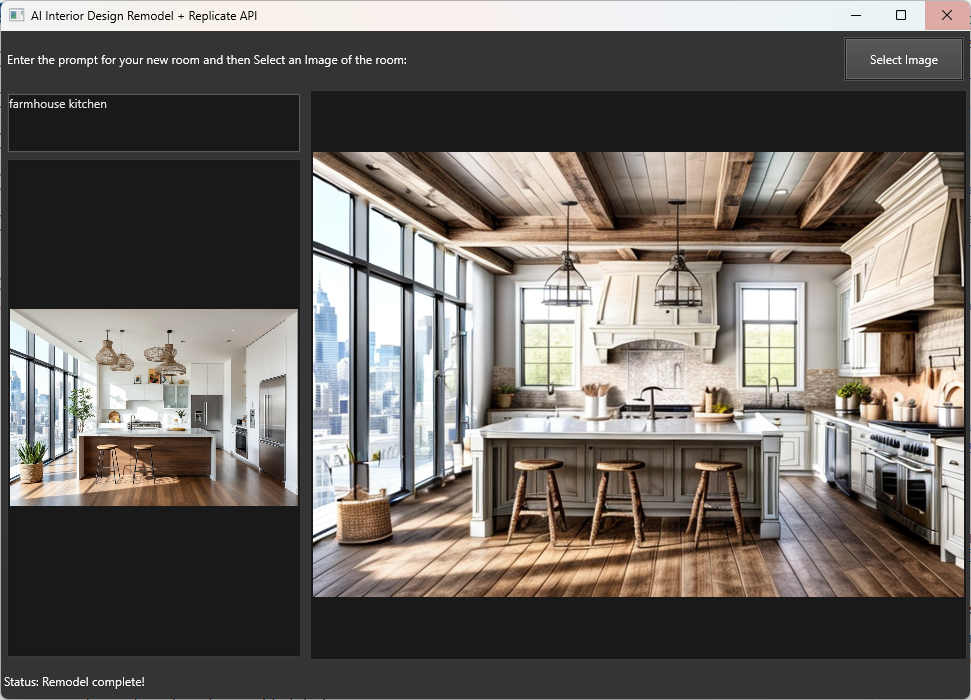

# AI Interior Design Remodel Tool

This project is a **desktop GUI application** built with **DelphiFMX for Python**. It leverages the **Replicate API** to generate AI-enhanced interior design and remodel suggestions from a text prompt and a user-uploaded room image.

## Features

- **Easy-to-use Interface**: Upload an image of your room, enter a design prompt, and get AI-generated remodel suggestions.
- **Text Prompt Based Design**: Provide specific instructions for how you want your room to look.
- **Real-time Status Updates**: The app provides feedback on the process and updates once the image remodeling is complete.
- **Uses Replicate's Model**: The app integrates with the [adirik/interior-design](https://replicate.com/adirik/interior-design) model on Replicate to process your room image based on the provided design prompt.

## Screenshot


## Technologies Used

- [DelphiFMX for Python](https://github.com/Embarcadero/DelphiFMX4Python): For building the desktop GUI.
- [Replicate API](https://replicate.com/docs/reference/python): For handling AI image generation and remodel processes.

## Installation

To run this project locally, follow these steps:

1. **Clone the repository**:
    ```bash
    git clone https://github.com/yourusername/ai-interior-design-remodel.git
    cd ai-interior-design-remodel
    ```

2. **Set up Python environment**:
    Make sure you have Python 3.7+ installed. Then, install the required dependencies:
    ```bash
    pip install delphifmx replicate
    ```

3. **Set your Replicate API token**:
    You will need a Replicate API key. Sign up at [Replicate](https://replicate.com) and get your API key. Then, set it in your environment:
    ```bash
    export REPLICATE_API_TOKEN='your_replicate_api_key'
    ```

4. **Run the Application**:
    Simply run the Python script:
    ```bash
    python interior_design.py
    ```

## Usage

1. **Enter a Text Prompt**: Enter a prompt that describes how you would like to redesign the room (e.g., "modern living room with minimal furniture and white walls").
2. **Upload an Image**: Click on the "Select Image" button to upload an image of your room.
3. **Wait for Processing**: The app will process the image based on your prompt and display the result. The status bar will keep you informed during the process.

## Example Prompt

- "Scandinavian style living room with natural light, wood furniture, and cozy rugs."


## Contributions

Feel free to fork this repository and submit pull requests. We welcome contributions to improve the functionality, user interface, and performance of the application.

## License

This project is licensed under the MIT License. See the [LICENSE](LICENSE) file for details.

## Acknowledgements

- Thanks to the [Replicate](https://replicate.com) team for providing a robust API for AI-based image processing.
- Special thanks to the [DelphiFMX for Python](https://github.com/Embarcadero/DelphiFMX4Python) team for the amazing cross-platform desktop application framework.
